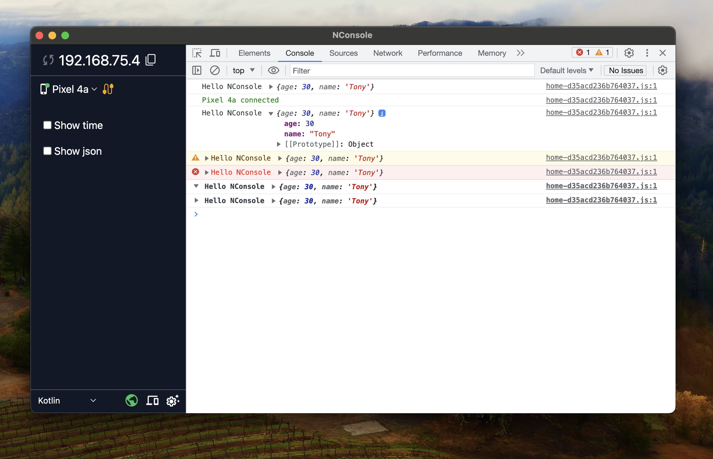

# NConsole

A library for show log in console




## Installation

App desktop download [NConsole](https://drive.google.com/drive/folders/1P4cqXhalzsiPtrVAKWvoD9tK_pt9ZpzJ?usp=share_link)

Add it in your root build.gradle at the end of repositories:

- Groovy DSL

```groovy
allprojects {
    repositories {
        ...
        maven { url 'https://jitpack.io' }
    }
}
```

- Kotlin DSL

```kotlin
allprojects {
    repositories {
        ...
        maven(url = "https://jitpack.io")
    }
}
```

Add the dependency

- Groovy DSL

```groovy
dependencies {
    implementation 'com.github.nghinv-software:nconsole-android:1.0.1'
}
```

- Kotlin DSL

```kotlin
dependencies {
    implementation("com.google.code.gson:gson:2.10.1")
    implementation("com.squareup.okhttp3:okhttp:4.11.0")

    implementation("com.github.nghinv-software:nconsole-android:1.0.1")
}
```

## Usages

```kotlin
import com.nghinv.nconsole.NConsole

data class User(val name: String, val age: Int)

class MainActivity : AppCompatActivity() {
    private val binding by lazy { ActivityMainBinding.inflate(layoutInflater) }

    override fun onCreate(savedInstanceState: Bundle?) {
        super.onCreate(savedInstanceState)

        setContentView(binding.root)

        NConsole.isEnable = true
        NConsole.setUri("ip_address:port")
        NConsole.setPublicKey("your_public_key")

        binding.btnSend.setOnClickListener {
            val user = User("Tony", 30)
            
            NConsole.log("Hello NConsole", user)

            NConsole.info("Hello NConsole", user)

            NConsole.warn("Hello NConsole", user)

            NConsole.error("Hello NConsole", user)

            NConsole.group("Hello NConsole", user)
            NConsole.groupEnd()
            
            NConsole.groupCollapsed("Hello NConsole", user)
            NConsole.groupEnd()
        }
    }
}
```
